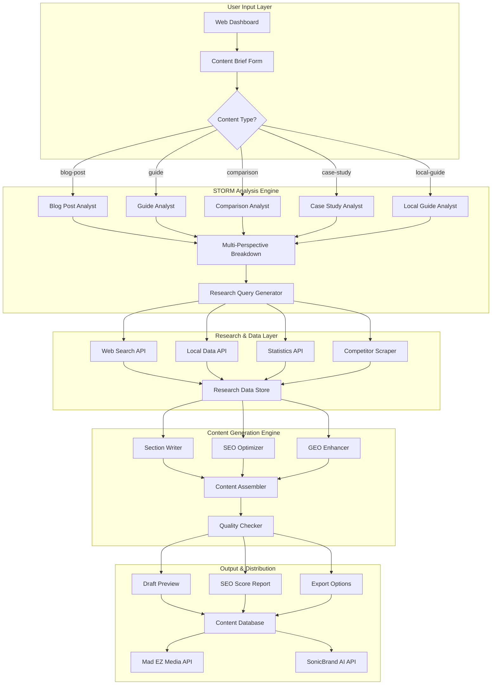

# Mad EZ Media / SonicBrand AI - STORM-Based Content Generation System

## Executive Summary

A custom STORM (Synthesis of Topic Outlines through Retrieval and Multi-perspective Question Asking) content generation system for Mad EZ Media / SonicBrand AI, focused on creating SEO-optimized, GEO-targeted content for local businesses, particularly restaurants and audio production services.

## System Overview



## Core Components

### 1. Input Layer

#### Content Brief Form
- **Purpose**: Collect user requirements for content generation
- **Input Fields**:
  - Topic/Subject
  - Content Type (blog-post, guide, comparison, case-study, local-guide)
  - SEO Parameters (keywords, difficulty, intent, target volume)
  - GEO Parameters (location, local keywords, geo-intent)
  - Brand Direction (audio-ugc, jingles, audio-trends)
  - Target Audience (segment, pain points, expertise level)
  - Content Parameters (word count, tone, include examples/stats/local-data)

#### Content Type Definitions

| Content Type | Description | Use Case | SEO Focus |
|-------------|-------------|------------|
| **Blog Post** | Informative article | Informational intent, keyword density |
| **Guide** | How-to/tutorial | Transactional intent, step-by-step |
| **Comparison** | Product/service comparison | Commercial intent, pros/cons |
| **Case Study** | Success story | Social proof, local relevance |
| **Local Guide** | Location-specific content | GEO targeting, local keywords |

### 2. STORM Analysis Engine

#### Multi-Perspective Breakdown
Breaks down topics using 5-7 key perspectives:

1. **Beginner Perspective**: Foundational concepts, common misconceptions
2. **Business Owner Perspective**: Practical benefits, ROI, costs, implementation time
3. **Local Market Perspective**: Local regulations, competitors, success stories, market uniqueness
4. **Technical Perspective**: How technology works, requirements, integrations
5. **Competitive Perspective**: Alternative solutions, comparison to traditional methods, pros/cons
6. **Customer Perspective**: Pain points, decision factors, user experience
7. **Industry Expert Perspective**: Best practices, trends, future outlook

#### Research Query Generator
- Generates targeted search queries for each perspective
- Includes SEO keywords naturally
- Incorporates GEO terms when enabled
- Produces 10-15 queries per section

### 3. Research & Data Layer

#### Web Search API
- **Provider**: Google Search API / Bing Search API
- **Features**:
  - Location-aware search (GEO)
  - Result caching
  - Source credibility scoring
  - Real-time trending data

#### Local Data API
- **Data Sources**:
  - Local business directories
  - Chamber of commerce data
  - City/municipal statistics
  - Local media outlets
- **Use Cases**:
  - Local competitor identification
  - Success story collection
  - Market statistics
  - Reference landmarks

#### Statistics API
- **Sources**:
  - Industry reports
  - Government statistics
  - Market research data
- **Features**:
  - Credible source attribution
  - Date range filtering
  - Statistical significance validation

#### Competitor Scraper
- **Purpose**: Analyze competitor content strategies
- **Data Points**:
  - Content length
  - Heading structure
  - Keyword usage
  - Internal/external link ratios
  - Content freshness

### 4. Content Generation Engine

#### Section Writer
- **AI Model**: Gemini 1.5 Pro / GPT-4
- **Process**:
  1. Receives research data + section outline
  2. Generates content from specific perspective
  3. Incorporates local data and statistics
  4. Includes examples and case studies
  5. Maintains consistent tone

#### SEO Optimizer
- **Features**:
  - Primary keyword placement (title, H2, intro, conclusion)
  - Secondary keyword integration
  - Keyword density monitoring (1-2% target)
  - Meta description generation
  - Heading structure validation (H1 → H2 → H3)
  - Internal linking suggestions

#### GEO Enhancer
- **Features**:
  - Natural location mentions
  - Local landmark references
  - Local business citations
  - Regional statistics integration
  - Local media outlet mentions

#### Content Assembler
- **Process**:
  1. Combines all sections
  2. Ensures flow and transitions
  3. Validates word count targets
  4. Adds introduction and conclusion
  5. Generates table of contents

#### Quality Checker
- **Checks**:
  - Grammar and spelling
  - Readability score
  - Flesch-Kincaid grade
  - Fact verification against sources
  - Duplicate content detection

### 5. Output & Distribution

#### Draft Preview
- **Features**:
  - Real-time preview
  - Edit mode
  - Version history
  - Collaboration comments

#### SEO Score Report
- **Metrics**:
  - Keyword coverage
  - Readability score
  - Content length
  - Heading structure
  - Internal/external link count
  - Estimated search ranking potential

#### Export Options
- **Formats**: Markdown, HTML, PDF, DOCX
- **Destinations**: 
  - Mad EZ Media CMS
  - SonicBrand AI platform
  - Direct download
  - Email delivery

## Data Models

### ContentBrief
```typescript
interface ContentBrief {
  id: string;
  userId: string;
  createdAt: Date;
  updatedAt: Date;
  
  // Core content
  topic: string;
  contentType: 'blog-post' | 'guide' | 'comparison' | 'case-study' | 'local-guide';
  
  // SEO parameters
  seo: SEOParameters;
  
  // GEO parameters
  geo: GEOParameters;
  
  // Brand direction
  brandDirection: 'audio-ugc' | 'jingles' | 'audio-trends';
  
  // Target audience
  targetAudience: TargetAudience;
  
  // Content parameters
  wordCount: number;
  tone: 'professional' | 'casual' | 'technical';
  includeExamples: boolean;
  includeStats: boolean;
  includeLocalData: boolean;
  
  // Status
  status: 'draft' | 'analyzing' | 'researching' | 'generating' | 'optimizing' | 'complete';
  generatedContent?: GeneratedContent;
}
```

### SEOParameters
```typescript
interface SEOParameters {
  primaryKeyword: string;
  secondaryKeywords: string[];
  targetVolume: number;           // Monthly search volume
  difficulty: 'easy' | 'medium' | 'hard';
  intent: 'informational' | 'commercial' | 'transactional';
}
```

### GEOParameters
```typescript
interface GEOParameters {
  enabled: boolean;
  location: {
    country: string;
    state?: string;
    city?: string;
    zipCode?: string;
  };
  localKeywords: string[];
  geoIntent: 'local-service' | 'regional-guide' | 'national';
}
```

### TargetAudience
```typescript
interface TargetAudience {
  segment: 'ecommerce' | 'local-business' | 'agency' | 'creator';
  painPoints: string[];
  expertise: 'beginner' | 'intermediate' | 'advanced';
}
```

### GeneratedContent
```typescript
interface GeneratedContent {
  id: string;
  briefId: string;
  title: string;
  metaDescription: string;
  content: string;
  wordCount: number;
  
  // Sections
  sections: ContentSection[];
  
  // SEO metrics
  seoScore: SEOScore;
  
  // Quality metrics
  qualityScore: QualityScore;
  
  // Sources
  sources: ContentSource[];
  
  // Version
  version: number;
  createdAt: Date;
}
```

## Database Schema

### Tables

#### content_briefs
```sql
CREATE TABLE content_briefs (
    id UUID PRIMARY KEY DEFAULT gen_random_uuid(),
    user_id UUID NOT NULL REFERENCES users(id),
    topic VARCHAR(500) NOT NULL,
    content_type VARCHAR(50) NOT NULL,
    seo JSONB NOT NULL,
    geo JSONB,
    brand_direction VARCHAR(50),
    target_audience JSONB NOT NULL,
    word_count INTEGER NOT NULL,
    tone VARCHAR(50) NOT NULL,
    include_examples BOOLEAN DEFAULT true,
    include_stats BOOLEAN DEFAULT true,
    include_local_data BOOLEAN DEFAULT false,
    status VARCHAR(50) DEFAULT 'draft',
    created_at TIMESTAMP DEFAULT NOW(),
    updated_at TIMESTAMP DEFAULT NOW()
);

CREATE INDEX idx_content_briefs_user_id ON content_briefs(user_id);
CREATE INDEX idx_content_briefs_status ON content_briefs(status);
CREATE INDEX idx_content_briefs_created_at ON content_briefs(created_at DESC);
```

#### generated_content
```sql
CREATE TABLE generated_content (
    id UUID PRIMARY KEY DEFAULT gen_random_uuid(),
    brief_id UUID NOT NULL REFERENCES content_briefs(id),
    title VARCHAR(500) NOT NULL,
    meta_description TEXT,
    content TEXT NOT NULL,
    word_count INTEGER NOT NULL,
    sections JSONB NOT NULL,
    seo_score JSONB NOT NULL,
    quality_score JSONB NOT NULL,
    sources JSONB NOT NULL,
    version INTEGER DEFAULT 1,
    created_at TIMESTAMP DEFAULT NOW(),
    
    UNIQUE(brief_id, version)
);

CREATE INDEX idx_generated_content_brief_id ON generated_content(brief_id);
CREATE INDEX idx_generated_content_created_at ON generated_content(created_at DESC);
```

#### research_data
```sql
CREATE TABLE research_data (
    id UUID PRIMARY KEY DEFAULT gen_random_uuid(),
    brief_id UUID NOT NULL REFERENCES content_briefs(id),
    query VARCHAR(500) NOT NULL,
    source VARCHAR(100),
    data JSONB NOT NULL,
    created_at TIMESTAMP DEFAULT NOW()
);

CREATE INDEX idx_research_data_brief_id ON research_data(brief_id);
```

## API Structure

### Endpoints

#### Content Briefs
```
POST   /api/v1/briefs              - Create new content brief
GET    /api/v1/briefs              - List user's briefs
GET    /api/v1/briefs/:id          - Get brief details
PUT    /api/v1/briefs/:id          - Update brief
DELETE /api/v1/briefs/:id          - Delete brief
```

#### Content Generation
```
POST   /api/v1/briefs/:id/generate  - Start generation
GET    /api/v1/briefs/:id/status   - Get generation status
GET    /api/v1/content/:id          - Get generated content
PUT    /api/v1/content/:id          - Edit content
POST   /api/v1/content/:id/export   - Export content
```

#### SEO Analysis
```
GET    /api/v1/content/:id/seo      - Get SEO score
POST   /api/v1/content/:id/optimize  - Re-optimize for SEO
```

## Integration Points

### Mad EZ Media CMS
- **Purpose**: Direct content publishing
- **API**: REST API for content push
- **Webhooks**: Content status notifications
- **Authentication**: API key based

### SonicBrand AI Platform
- **Purpose**: Audio content generation
- **Integration**:
  - Pass generated scripts to SonicBrand AI
  - Receive audio files back
  - Combine audio with text content
- **Webhooks**: Audio generation completion

### API Integration for External Apps

#### Quick Start Integration

**Purpose**: Allow any application to integrate STORM content generation with minimal setup

**Authentication**:
```typescript
// API Key based authentication
const apiKey = process.env.STORM_API_KEY;

// Headers for all requests
const headers = {
  'Authorization': `Bearer ${apiKey}`,
  'Content-Type': 'application/json'
};
```

**Base URL**: `https://api.storm.madezmedia.com/v1`

#### Content Brief Endpoints

```typescript
// Create new content brief
POST /api/v1/briefs
{
  "topic": "How Charlotte Restaurants Can Create Radio Jingles with AI",
  "contentType": "local-guide",
  "seo": {
    "primaryKeyword": "restaurant radio jingles charlotte",
    "secondaryKeywords": ["charlotte restaurant marketing", "radio ads charlotte nc"],
    "targetVolume": 180,
    "difficulty": "easy",
    "intent": "commercial"
  },
  "geo": {
    "enabled": true,
    "location": {
      "country": "United States",
      "state": "North Carolina",
      "city": "Charlotte",
      "zipCode": null
    },
    "localKeywords": ["charlotte restaurants", "nc radio advertising", "uptown charlotte businesses"],
    "geoIntent": "local-service"
  },
  "brandDirection": "jingles",
  "targetAudience": {
    "segment": "local-business",
    "painPoints": ["expensive voice actors", "no music production skills", "need fast turnaround"],
    "expertise": "beginner"
  },
  "wordCount": 2200,
  "tone": "professional",
  "includeExamples": true,
  "includeStats": true,
  "includeLocalData": true
}

// Response
{
  "id": "uuid",
  "status": "draft",
  "createdAt": "2026-01-16T20:00:00Z"
}
```

```typescript
// Get brief status
GET /api/v1/briefs/:id/status

// Response (streaming)
{
  "briefId": "uuid",
  "status": "analyzing" | "researching" | "generating" | "optimizing" | "complete",
  "progress": 35,  // Percentage complete
  "currentPhase": "STORM Analysis",
  "estimatedTimeRemaining": 180  // Seconds
}
```

#### Content Generation Endpoints

```typescript
// Start generation
POST /api/v1/briefs/:id/generate

// Response
{
  "generationId": "uuid",
  "status": "researching",
  "estimatedTime": 300  // Seconds
}
```

```typescript
// Get generated content
GET /api/v1/content/:id

// Response
{
  "id": "uuid",
  "briefId": "uuid",
  "title": "How Charlotte Restaurants Can Create Radio Jingles with AI (2026 Guide)",
  "metaDescription": "Charlotte restaurant owners: Learn how to create memorable radio jingles...",
  "content": "Full markdown content...",
  "wordCount": 2200,
  "seoScore": {
    "overall": 85,
    "grade": "B",
    "keywordDensity": 1.5,
    "readability": 82
  },
  "geoScore": 78,
  "qualityScore": {
    "grammar": 95,
    "spelling": 98,
    "fleschGrade": "B+"
  },
  "sources": [...],
  "version": 1,
  "createdAt": "2026-01-16T20:30:00Z"
}
```

```typescript
// Export content
POST /api/v1/content/:id/export
{
  "format": "markdown" | "html" | "pdf" | "docx",
  "destination": "madezmedia" | "sonicbrand" | "download"
}

// Response
{
  "exportId": "uuid",
  "status": "processing",
  "downloadUrl": "https://...",
  "expiresAt": "2026-01-16T21:00:00Z"
}
```

#### SEO Analysis Endpoints

```typescript
// Get SEO analysis
GET /api/v1/content/:id/seo

// Response
{
  "contentId": "uuid",
  "seoScore": 85,
  "keywordAnalysis": {
    "primaryKeyword": {
      "keyword": "restaurant radio jingles charlotte",
      "count": 33,
      "density": 1.5,
      "placement": {
        "title": true,
        "firstParagraph": true,
        "h2Headings": 2,
        "conclusion": false
      }
    },
    "secondaryKeywords": [
      {
        "keyword": "charlotte restaurant marketing",
        "count": 12,
        "naturallyPlaced": true
      }
    ]
  },
  "readability": {
    "score": 82,
    "grade": "B",
    "fleschKincaid": "B+",
    "avgSentenceLength": 18,
    "avgParagraphLength": 3
  },
  "headingStructure": {
    "h1": 1,
    "h2": 7,
    "h3": 15,
    "missing": ["h2 for conclusion"]
  },
  "recommendations": [
    {
      "type": "keyword-density",
      "priority": "medium",
      "message": "Keyword density is 1.5%. Target: 1-2%",
      "fix": "Add 5 more mentions of 'restaurant radio jingles charlotte'"
    }
  ]
}
```

#### Webhook Endpoints

```typescript
// Content generation complete webhook
POST /api/v1/webhooks/generation-complete
{
  "contentId": "uuid",
  "briefId": "uuid",
  "title": "...",
  "wordCount": 2200,
  "seoScore": 85,
  "generatedAt": "2026-01-16T20:30:00Z",
  "webhookUrl": "https://your-app.com/webhooks/storm"
}

// Response
{
  "status": "delivered",
  "deliveredAt": "2026-01-16T20:30:01Z"
}
```

#### SDK / Client Libraries

**JavaScript/TypeScript:**

```typescript
// npm install @madezmedia/storm-client
import { StormClient } from '@madezmedia/storm-client';

const client = new StormClient({
  apiKey: process.env.STORM_API_KEY,
  baseUrl: 'https://api.storm.madezmedia.com/v1'
});

// Create brief
const brief = await client.briefs.create({
  topic: 'How Charlotte Restaurants Can Create Radio Jingles with AI',
  contentType: 'local-guide',
  // ... other parameters
});

// Start generation
const generation = await client.briefs.generate(brief.id);

// Stream progress
generation.on('progress', (data) => {
  console.log(`Progress: ${data.progress}% - ${data.currentPhase}`);
});

// Get result
const content = await client.content.get(generation.contentId);
```

**Python:**

```python
# pip install madezmedia-storm
from storm_client import StormClient

client = StormClient(
    api_key='your-api-key',
    base_url='https://api.storm.madezmedia.com/v1'
)

# Create brief
brief = client.create_brief(
    topic='How Charlotte Restaurants Can Create Radio Jingles with AI',
    content_type='local-guide',
    # ... other parameters
)

# Start generation
generation = client.generate_brief(brief.id)

# Stream progress
for update in generation.stream():
    print(f"Progress: {update.progress}% - {update.current_phase}")

# Get result
content = client.get_content(generation.content_id)
```

**cURL Examples:**

```bash
# Create brief
curl -X POST https://api.storm.madezmedia.com/v1/briefs \
  -H "Authorization: Bearer YOUR_API_KEY" \
  -H "Content-Type: application/json" \
  -d '{
    "topic": "How Charlotte Restaurants Can Create Radio Jingles with AI",
    "contentType": "local-guide",
    "seo": {
      "primaryKeyword": "restaurant radio jingles charlotte"
    }
  }'

# Start generation
curl -X POST https://api.storm.madezmedia.com/v1/briefs/BRIEF_ID/generate \
  -H "Authorization: Bearer YOUR_API_KEY"

# Get content
curl https://api.storm.madezmedia.com/v1/content/CONTENT_ID \
  -H "Authorization: Bearer YOUR_API_KEY"
```

## Technology Stack

### Backend
- **Framework**: FastAPI / Python
- **AI Models**: Gemini 1.5 Pro, GPT-4
- **Database**: PostgreSQL
- **Search**: Google Search API, Bing Search API
- **Queue**: Redis (for async processing)
- **Caching**: Redis

### Frontend
- **Framework**: Next.js 15
- **UI Library**: React + Tailwind CSS
- **State Management**: Zustand
- **AI SDK**: Vercel AI SDK
- **Charts**: Recharts (for SEO scores)

### Infrastructure
- **Hosting**: Vercel (frontend) + Railway/Render (backend)
- **Database**: Supabase / Neon
- **CDN**: Cloudflare
- **Monitoring**: Sentry + LangSmith

## Security Considerations

- **API Keys**: Environment variables, never in code
- **User Authentication**: JWT tokens
- **Rate Limiting**: Per-user and per-IP
- **Input Validation**: Strict schema validation
- **Content Sanitization**: XSS prevention
- **CORS**: Restricted to allowed domains

## Performance Targets

- **Content Generation**: < 60 seconds for 2000 words
- **SEO Analysis**: < 10 seconds
- **API Response**: < 200ms p95
- **Database Query**: < 50ms average
- **Frontend Load**: < 2 seconds initial, < 500ms navigation

## Success Metrics

- **Content Quality**: > 85% readability score
- **SEO Score**: > 80/100
- **User Satisfaction**: > 4.5/5 rating
- **Generation Success Rate**: > 95%
- **API Uptime**: > 99.5%
